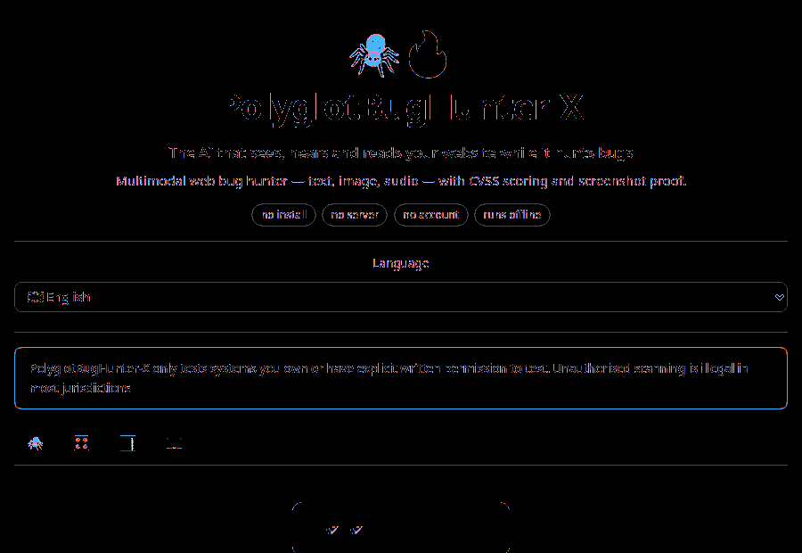

<div align="center">



# 🕷️🔥 PolyglotBugHunter-X


### Bro, imagine an AI that can **see**, **hear**, and **read** a website while hunting bugs at the same time. Yeah, that's PolyglotBugHunter-X.

[](https://huggingface.co/spaces/Kicaulah/polyglot-bughunter-x-static)
[](https://huggingface.co/Kicaulah/polyglot-bughunter-x)
[](https://huggingface.co/datasets/Kicaulah/polyglot-bug-patterns)
[](https://github.com/Kicaulah/polyglot-bughunter-x)
[](LICENSE)
[](https://www.python.org/downloads/)

</div>

---

## 🚀 Fire this up in one click

<div align="center">

### **[🎨 Try it live on the Space](https://huggingface.co/spaces/Kicaulah/polyglot-bughunter-x-static)**
#### no install · no account · no API key · works on a free CPU tier

</div>

Press **🚀 Scan Example** and it boots a deliberately vulnerable app on
`127.0.0.1`, attacks it across all three modalities, and renders a full report in
about five seconds: SQLi, IDOR, SSTI, XSS, SSRF, open redirect, weak cookies,
exposed `.env`, audio polyglots and a visual prompt-injection canary — each with a
**CVSS v3.1** score and evidence you can re-check.

Nothing leaves the container. Nobody gets an angry email. It always works.

---

## 🤔 What is this?

A **multimodal agent for automated web security testing** — for systems you own or
have written permission to test.

| Modality | What it does |
|---|---|
| ⌨️ **Text** | Reflected XSS, SQLi (boolean/error/UNION differentials), command injection, SSTI, path traversal, SSRF, open redirect, NoSQL/LDAP, prompt injection, IDOR, CSRF, race conditions, DOM-XSS sinks |
| 🖼️ **Image** | Screenshot diffing with hotspot boxes, EXIF/GPS privacy audit, alt-text prompt injection, generated near-invisible-text canary |
| 🎙️ **Audio** | RIFF/HTML/ZIP polyglots, silence + decode-bomb checks, spectrogram injection, tone-encoded instructions, STT-pipeline prompt injection |
| 👁️ **Passive** | CSP/HSTS/nosniff/XFO, cookie flags, CORS reflection with credentials, mixed content, TLS, exposed `.env`/`.git`/`wp-config`/`/actuator/env`, fingerprinting, debug leaks |

**43 payloads across 8 bug classes — 24 of them polyglot.** A polyglot payload is
a single string that is simultaneously plausible HTML, JS, SQL *and* shell, so it
escapes whatever context your app dropped it into. That's the house style.

### Why not just call a transformer?

Because a scanner that hallucinates a finding is worse than no scanner.

Every verdict here comes from a **reproducible comparison** — a captured baseline
response versus an injected one — and every finding ships the exact request,
response snippet and signal that produced it. `{{7*7}}` coming back as `49` is
proof. "This looks exploitable" is labelled `needs-manual-confirm` and says so.

Scoring is real **CVSS v3.1** base vectors, cross-checked against RedHat's `cvss`
library over **5000 random vectors: 0 mismatches**.

## 🌍 Twelve languages

🇬🇧 EN · 🇨🇳 中文 · 🇯🇵 日本語 · 🇰🇷 한국어 · 🇮🇩 ID · 🇪🇸 ES · 🇸🇦 AR · 🇷🇺 RU ·
🇩🇪 DE · 🇫🇷 FR · 🇵🇹 PT · 🇮🇳 HI

160 keys each, 100% coverage, no blanks. Auto-detected from `navigator.language`;
a dropdown re-renders the entire UI *and* the report. Arabic gets proper RTL.

<details>
<summary>Translations live in <code>/locales/</code> — English is the master, the rest are translations</summary>

```
locales/
├── en.json   160 keys  ← MASTER
├── zh.json   160 keys  中文
├── ja.json   160 keys  日本語
├── ko.json   160 keys  한국어
├── id.json   160 keys  Bahasa Indonesia
├── es.json   160 keys  Español
├── ar.json   160 keys  العربية  (RTL)
├── ru.json   160 keys  Русский
├── de.json   160 keys  Deutsch
├── fr.json   160 keys  Français
├── pt.json   160 keys  Português
└── hi.json   160 keys  हिन्दी
```

Missing keys fall back to English rather than showing raw `snake_case` to a user.
</details>

## ⚡ Quick start

```bash
git clone https://github.com/Kicaulah/polyglot-bughunter-x
cd polyglot-bughunter-x
pip install -r requirements.txt          # gradio only; everything else is optional
```

```python
from polyglot_bug_hunter import Hunter, ScanPolicy

# 1. the demo. boots its own vulnerable target on localhost. no auth needed.
report = Hunter.demo()
print(report.risk_score, report.counts())

# 2. your own infrastructure. the authorization tick is mandatory.
policy = ScanPolicy(
    authorization_confirmed=True,
    authorization_note="staging.mycompany.com, ticket SEC-1234",
    active_probing=True,
)
report = Hunter(policy, modes=["text", "image", "audio"], lang="auto").scan(
    "https://staging.mycompany.com"
)

paths = report and Hunter(policy).save()   # md / html / json / sarif
for f in report.sorted_findings()[:5]:
    print(f.severity.value, f.cvss.score, f.title)
```

Run it locally:

```bash
python -m polyglot_bug_hunter.demo_target 8787   # poke the vulnerable app yourself
python tools/build_dataset.py                    # regenerate the HF dataset
python tools/build_space.py                      # assemble the Space folder
python -m pytest -q                              # the test suite
```

## 🗂️ Project layout

```
polyglot-bughunter-x/
├── src/polyglot_bug_hunter/
│   ├── safety.py         5 gates: auth, network range, scheme, payload, rate limit
│   ├── hunter.py         the orchestrator. one class, .scan(url) -> report
│   ├── demo_target.py    an intentionally vulnerable app we host ourselves
│   ├── models.py         Finding / Evidence / Asset / ScanReport + CVSS v3.1 math
│   ├── payloads.py       43 payloads, param-name routing, safety-classified
│   ├── net.py            stdlib HTTP client + `replace_param` (see below)
│   ├── htmlx.py          HTML parsing, link/param ranking, DOM-XSS sink audit
│   ├── config.py         ScanConfig / ModalityConfig
│   ├── i18n.py           12 locales, auto-detect, RTL
│   ├── scanner/
│   │   ├── text.py       differential injection analysis
│   │   ├── passive.py    headers, cookies, CORS, TLS, exposure
│   │   ├── image.py      PNG encode/decode, pixel diff, visual canary
│   │   ├── audio.py      wav synthesis, spectrogram attack, container audit
│   │   ├── access.py     IDOR walk
│   │   └── race.py       TOCTOU probes + CSRF assessment
│   ├── report/render.py  markdown, self-contained HTML, JSON, SARIF
│   └── storage/db.py     DuckDB or sqlite3, same API
├── hf_space/         → upload as a Space (4 tabs, 12 languages, CPU-only)
├── hf_model/         → upload as a Model (config.json + payload vocabulary)
├── hf_dataset/       → upload as a Dataset (JSONL + Parquet)
├── notebooks/hf_demo.ipynb
├── locales/          → 12 JSON locale files
├── tools/            → build_space.py, build_dataset.py, build_notebook.py
└── tests/
```

## 🛡️ The safety model

This tool fires requests at someone else's machine, so the *first* import in the
package is `safety.py` and nothing touches the network until a `ScanPolicy` says
yes.

| Gate | Behaviour |
|---|---|
| **Authorization** | `authorization_confirmed=False` → `AuthorizationError` before any byte moves |
| **Network range** | loopback, RFC1918, link-local (so cloud metadata at `169.254.169.254`), CGNAT, multicast, reserved → refused by default. DNS resolved by us, so DNS-rebinding can't sneak past |
| **Scheme** | `file://`, `gopher://`, `javascript:` → refused |
| **Payload** | `DROP TABLE`, `DELETE FROM`, `system(`, `sleep(`, `xp_cmdshell`, `rm -rf` → blocked at the boundary, for community payloads too |
| **Methods** | `POST/PUT/PATCH/DELETE` refused unless explicitly enabled |
| **Rate limit** | mandatory, 5–120 req/min, plus a hard total request budget |

Time-based blind SQLi is **deliberately not implemented** — `sleep()` is on the
blocklist, and a scanner that can hang a database is a scanner that can be used
as a DoS tool.

> ⚠️ **Only test systems you own or have explicit written permission to test.**
> Unauthorised scanning is illegal in most jurisdictions (CFAA 18 U.S.C. §1030,
> UK CMA 1990 s.1, id. UU ITEA Pasal 35-51). You are 100% responsible for every
> target you point this at.

## 📦 The Hugging Face family

| Repo | What it is |
|---|---|
| 🎨 [`polyglot-bughunter-x-static`](https://huggingface.co/spaces/Kicaulah/polyglot-bughunter-x-static) | **The Space.** Static, 4 tabs, 12 languages, 100% in-browser, free tier, no cold start. |
| 🐍 [`polyglot-bughunter-x`](https://huggingface.co/spaces/Kicaulah/polyglot-bughunter-x-static) | The full Gradio Space. Needs HF PRO (HF blocks new Gradio Spaces on the free tier). |
| 🧠 [`polyglot-bughunter-x`](https://huggingface.co/Kicaulah/polyglot-bughunter-x) | Model repo: `config.json`, 43-payload vocabulary, CVSS + scoring profile. |
| 🗃️ [`polyglot-bug-patterns`](https://huggingface.co/datasets/Kicaulah/polyglot-bug-patterns) | Dataset: payloads + real detector output, JSONL **and** Parquet. |
| 📓 [`hf_demo.ipynb`](notebooks/hf_demo.ipynb) | Runnable walkthrough. Works on HF Jupyter, Colab, Kaggle. |
| 💻 [GitHub](https://github.com/Kicaulah/polyglot-bughunter-x) | Source, issues, PRs. |

```python
from datasets import load_dataset
ds = load_dataset("Kicaulah/polyglot-bug-patterns", "payloads")
polyglots = ds["train"].filter(lambda r: r["polyglot"])
print(len(polyglots), "polyglot payloads")
```

## 🧱 Engineering notes

A few decisions worth knowing about, because they're the difference between a
tool and a demo:

* **The core is stdlib-only.** No requests, no bs4, no pillow, no numpy. A Space
  that needs a 400 MB wheel download loses every visitor to a cold start.
  Optional deps are adapters that return empty results instead of raising.
* **`replace_param()` rebuilds the URL.** Appending to a URL that already has the
  parameter produces `/x?id=1&id=2`, and most servers honour the *first* one — so
  every differential test silently comes back "clean". This one function is the
  difference between a working scanner and a scanner that finds nothing.
* **The PNG codec is hand-rolled** (`zlib` + `struct`). 120 lines to generate a
  canary with hidden pixels and to decode a screenshot for the pixel diff. No
  Pillow on the critical path.
* **Findings dedupe by scope.** A missing CSP is one finding with "affects 8
  pages", not eight identical rows. Injection findings key on path + parameter, so
  `?q=a` and `?q=b` are the same bug.
* **The demo target simulates, it doesn't execute.** It reproduces the four
  responses a real injectable app gives. Findings against it prove the *detector*.

## 📝 Changelog

### v1.0.0 — first flight 🚀
* 4-tab Gradio Space, 12 languages, 100% CPU, one-click offline demo.
* 43 payloads / 8 classes, 24 polyglot, param-name routing.
* CVSS v3.1 validated against an independent implementation (5000 vectors, 0 mismatches).
* Markdown / HTML / JSON / SARIF reports, DuckDB-or-sqlite history.
* `findings`, `scans`, `class_index` dataset configs in JSONL + Parquet.
* 5-gate safety model, destructive-payload blocklist, mandatory rate limiting.

<sub>MIT licensed · 🕷️ PolyglotBugHunter-X · authorized security testing only</sub>